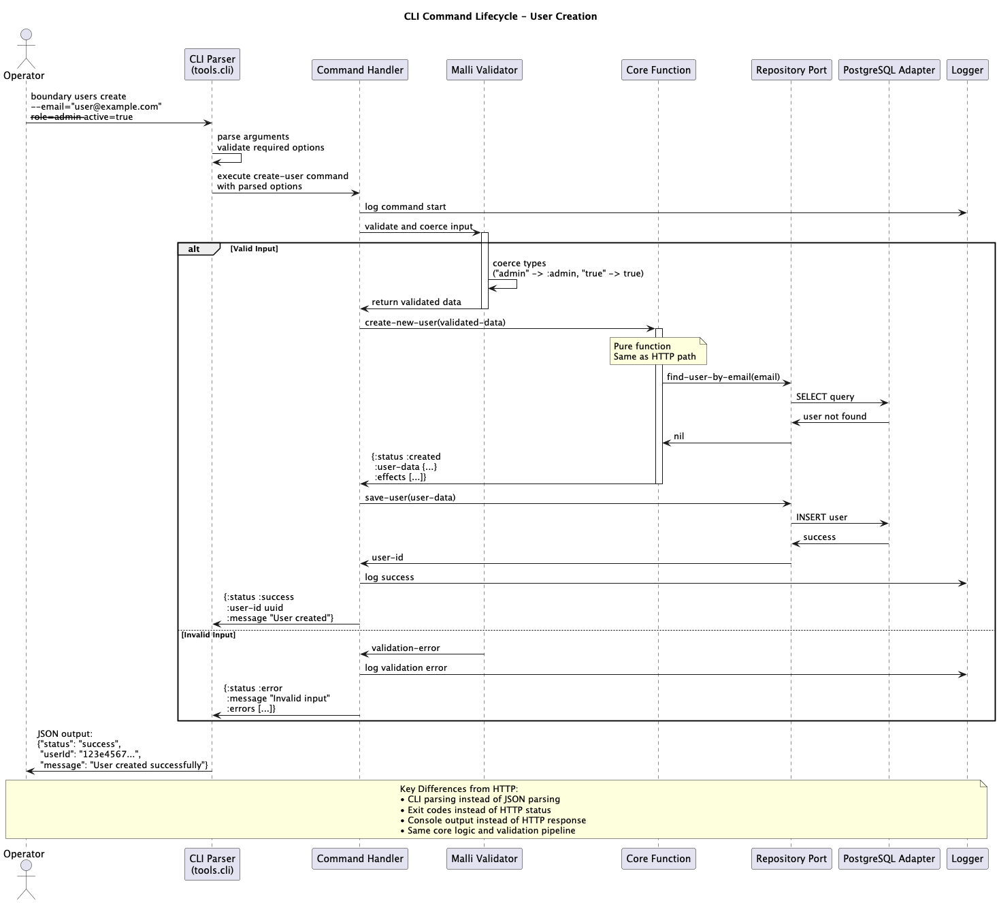

= Integration Patterns

[abstract]
--
This document details the integration patterns used in Boundary Framework to provide consistent behavior across REST API, CLI, and Web interfaces. It covers routing strategies, request processing patterns, response formatting, and versioning approaches that maintain architectural integrity while serving different client types.
--

== Audience and Scope

**Primary Audience:** API Integrators, Platform Engineers, Domain Developers

**Scope:** Interface-specific implementation patterns, routing strategies, versioning, backward compatibility

**Prerequisites:** Understanding of link:data-flow.adoc[Data Flow Architecture] and link:components.adoc[Component Architecture]

== Key Takeaways

After reading this document, you will understand:

* ✅ **REST API patterns** for routing, validation, and response formatting
* ✅ **CLI integration strategies** for command parsing and output formatting
* ✅ **Web interface patterns** for real-time communication and user interactions
* ✅ **Consistency mechanisms** ensuring uniform behavior across all interfaces
* ✅ **Versioning strategies** for backward compatibility and API evolution

== Integration Architecture Overview

.Interface Integration Flow
image::images/http-request-lifecycle.png[HTTP Request Lifecycle, 800]

Boundary provides three primary integration interfaces, each tailored to specific use cases while maintaining consistent underlying behavior:

**REST API**: Programmatic access for system integration and automation

**CLI**: Operational tasks, scripting, and administrative functions

**Web Interface**: Interactive user experience with real-time capabilities

=== Consistency Principles

**Shared Core Logic**: All interfaces use the same service layer and core functions

**Uniform Validation**: Same Malli schemas validate data regardless of interface

**Consistent Errors**: Standardized error types and correlation ID tracking

**Same Business Rules**: Identical behavior and business logic across all interfaces

== REST API Integration Patterns

=== Routing and Request Handling

Boundary uses Ring and Reitit for HTTP handling with a clean separation between routing configuration and handler implementation.

[source,clojure]
----
;; HTTP routing configuration with module-centric organization
(ns boundary.platform.shell.interfaces.http.routes
  "HTTP API routing configuration - aggregates routes from all modules."
  (:require [boundary.core.user.http :as user-http]
            [boundary.core.membership.http :as membership-http]
            [boundary.core.billing.http :as billing-http]
            [boundary.platform.shell.interfaces.http.middleware :as middleware]
            [boundary.platform.shell.interfaces.http.monitoring :as monitoring]
            [reitit.ring :as ring]
            [reitit.swagger :as swagger]
            [reitit.ring.middleware.parameters :as parameters]
            [reitit.ring.middleware.muuntaja :as muuntaja]
            [reitit.ring.coercion :as coercion]
            [reitit.coercion.malli :as malli-coercion]))

(defn api-routes
  "Aggregate API routes from all modules."
  [system]
  [["/api"
    {:swagger {:tags ["Boundary API"]}}
    
    ["/v1"
     {:middleware [middleware/correlation-id
                   middleware/request-logging
                   middleware/error-handling]}
     
     ;; Module-specific route aggregation
     (user-http/routes system)        ;; User module routes
     (membership-http/routes system)  ;; Membership module routes
     (billing-http/routes system)     ;; Billing module routes (feature-flagged)
     
     ;; System monitoring routes (cross-cutting)
     (monitoring/routes system)]]])

(defn create-app
  "Create the Ring application with middleware stack."
  [system]
  (ring/ring-handler
   (ring/router
    (api-routes system)
    {:data {:coercion malli-coercion/coercion
            :muuntaja muuntaja/instance
            :middleware [[parameters/parameters-middleware]
                        [muuntaja/format-negotiate-middleware]
                        [muuntaja/format-response-middleware]
                        [coercion/coerce-exceptions-middleware]
                        [coercion/coerce-request-middleware]
                        [coercion/coerce-response-middleware]
                        [swagger/swagger-feature]]}})
   (ring/routes
    (swagger/create-swagger-ui-handler {:path "/api-docs"})
    (ring/create-default-handler))))
----

=== Modular HTTP Handler Structure

To align with our domain-driven modular approach, HTTP handlers are organized by domain with shared cross-cutting concerns separated:

[source,clojure]
----
;; Cross-cutting HTTP handler utilities
(ns boundary.platform.shell.interfaces.http.common
  "Common HTTP handler utilities shared across all domains."
  (:require [ring.util.response :as response]
            [clojure.tools.logging :as log]
            [cheshire.core :as json]))

;; Common response transformation utilities
(defn transform-service-result-to-http
  "Transform service layer result to HTTP response."
  [service-result correlation-id]
  (case (:status service-result)
    :success
    (let [status-code (get service-result :http-status 200)]
      (-> (response/response (:data service-result))
          (response/status status-code)
          (response/header "Content-Type" "application/json")
          (response/header "X-Correlation-ID" correlation-id)))
    
    :error
    (let [status-code (map-error-type-to-http-status (:error-type service-result))
          problem-details (create-problem-details service-result correlation-id)]
      (-> (response/response problem-details)
          (response/status status-code)
          (response/header "Content-Type" "application/problem+json")
          (response/header "X-Correlation-ID" correlation-id)))))

(defn map-error-type-to-http-status
  "Map service error types to HTTP status codes."
  [error-type]
  (case error-type
    :validation-failed 400
    :user-not-found 404
    :duplicate-user 409
    :invalid-data 400
    :unauthorized 401
    :forbidden 403
    :rate-limited 429
    :internal-error 500
    500))  ; Default

(defn create-problem-details
  "Create RFC 7807 Problem Details for HTTP errors."
  [service-result correlation-id]
  {:type (str "https://api.boundary.example/errors/" (name (:error-type service-result)))
   :title (error-type-to-title (:error-type service-result))
   :status (map-error-type-to-http-status (:error-type service-result))
   :detail (:message service-result)
   :instance (str "/requests/" correlation-id)
   :errors (:errors service-result)})

;; Base handler construction helpers
(defn with-correlation-logging
  "Add correlation ID and logging to handler."
  [handler-fn operation-description]
  (fn [request]
    (let [correlation-id (get-correlation-id request)]
      (log/info "REST API: Processing request" 
               {:correlation-id correlation-id
                :operation operation-description
                :path (:uri request)})
      (handler-fn request correlation-id))))

;; Reusable response patterns
(defn created-response [resource-id resource-data correlation-id]
  (-> (response/response resource-data)
      (response/status 201)
      (response/header "Location" (str "/api/v1/" resource-id))
      (response/header "Content-Type" "application/json")
      (response/header "X-Correlation-ID" correlation-id)))
----

=== Module-Centric HTTP Integration

Each module owns its complete HTTP integration including handlers, routes, and schemas:

[source,clojure]
----
;; User module HTTP integration
(ns boundary.core.user.http
  "User module HTTP interface - handlers, routes, and schemas."
  (:require [boundary.core.user.user :as user-core]
            [boundary.core.user.schema :as user-schema]
            [boundary.platform.shell.interfaces.http.common :as http-common]
            [reitit.coercion.malli :as malli]
            [clojure.tools.logging :as log]))

;; User-specific handlers
(defn handle-create-user [system]
  (http-common/with-correlation-logging
    (fn [request correlation-id]
      (let [user-data (get-in request [:parameters :body])
            service-result (user-core/register-user system user-data)]
        (http-common/transform-service-result-to-http service-result correlation-id)))
    "Create user"))

(defn handle-get-user [system]
  (http-common/with-correlation-logging
    (fn [request correlation-id]
      (let [user-id (get-in request [:parameters :path :user-id])
            service-result (user-core/get-user system user-id)]
        (http-common/transform-service-result-to-http service-result correlation-id)))
    "Get user"))

(defn handle-update-user [system]
  (http-common/with-correlation-logging
    (fn [request correlation-id]
      (let [user-id (get-in request [:parameters :path :user-id])
            update-data (get-in request [:parameters :body])
            service-result (user-core/update-user system user-id update-data)]
        (http-common/transform-service-result-to-http service-result correlation-id)))
    "Update user"))

;; User module routes
(defn routes [system]
  ["/users"
   {:swagger {:tags ["Users"]}}
   
   ;; Create user
   ["" {:post {:summary "Create a new user"
               :parameters {:body user-schema/UserRegistrationRequest}
               :responses {201 {:description "User created successfully"
                               :body user-schema/UserCreationResponse}
                          400 {:description "Invalid input data"}
                          409 {:description "User already exists"}}
               :handler (handle-create-user system)}}]
   
   ;; User operations by ID
   ["/:user-id"
    {:get {:summary "Get user by ID"
           :parameters {:path [:map [:user-id uuid?]]}
           :responses {200 {:description "User found"
                           :body user-schema/UserResponse}
                      404 {:description "User not found"}}
           :handler (handle-get-user system)}
     
     :put {:summary "Update user information"
           :parameters {:path [:map [:user-id uuid?]]
                       :body user-schema/UserUpdateRequest}
           :responses {200 {:description "User updated successfully"}
                      404 {:description "User not found"}}
           :handler (handle-update-user system)}}]])
----

[source,clojure]
----
;; Membership module HTTP integration
(ns boundary.core.membership.http
  "Membership module HTTP interface."
  (:require [boundary.core.membership.membership :as membership-core]
            [boundary.core.membership.schema :as membership-schema]
            [boundary.platform.shell.interfaces.http.common :as http-common]))

;; Membership-specific handlers
(defn handle-get-benefits [system]
  (http-common/with-correlation-logging
    (fn [request correlation-id]
      (let [user-id (get-in request [:parameters :path :user-id])
            service-result (membership-core/get-user-benefits system user-id)]
        (http-common/transform-service-result-to-http service-result correlation-id)))
    "Get user benefits"))

(defn handle-refresh-benefits [system]
  (http-common/with-correlation-logging
    (fn [request correlation-id]
      (let [user-id (get-in request [:parameters :path :user-id])
            service-result (membership-core/refresh-user-benefits system user-id)]
        (http-common/transform-service-result-to-http service-result correlation-id)))
    "Refresh user benefits"))

;; Membership module routes
(defn routes [system]
  ["/users/:user-id/benefits"
   {:swagger {:tags ["Membership"]}}
   
   ;; Get benefits
   {:get {:summary "Get user membership benefits"
          :parameters {:path [:map [:user-id uuid?]]}
          :responses {200 {:description "Benefits retrieved"
                          :body membership-schema/BenefitsResponse}
                     404 {:description "User not found"}}
          :handler (handle-get-benefits system)}
    
    ;; Refresh benefits
    :post {:summary "Recalculate user benefits"
           :parameters {:path [:map [:user-id uuid?]]}
           :responses {200 {:description "Benefits recalculated"}
                      404 {:description "User not found"}}
           :handler (handle-refresh-benefits system)}}])
----

[source,clojure]
----
;; Billing module HTTP integration (feature-flagged)
(ns boundary.core.billing.http
  "Billing module HTTP interface."
  (:require [boundary.core.billing.billing :as billing-core]
            [boundary.core.billing.schema :as billing-schema]
            [boundary.platform.shell.interfaces.http.common :as http-common]
            [boundary.config :as config]))

;; Feature flag check
(defn billing-enabled? [system]
  (get-in (config/get-config system) [:features :billing-module] false))

;; Billing module routes (conditionally included)
(defn routes [system]
  (when (billing-enabled? system)
    ["/billing"
     {:swagger {:tags ["Billing"]}}
     
     ["/invoices"
      {:get {:summary "List user invoices"
             :parameters {:query billing-schema/InvoiceListQuery}
             :responses {200 {:description "Invoices retrieved"
                             :body billing-schema/InvoiceListResponse}}
             :handler (handle-list-invoices system)}}]
     
     ["/payments"
      {:post {:summary "Process payment"
              :parameters {:body billing-schema/PaymentRequest}
              :responses {201 {:description "Payment processed"
                              :body billing-schema/PaymentResponse}
                         400 {:description "Invalid payment data"}}
              :handler (handle-process-payment system)}}]]))
----

=== Benefits of Modular Handler Organization

[IMPORTANT]
.Modular Design Advantages
====
**✅ Domain Alignment**: Each domain's handlers are co-located with their domain logic

**✅ Team Ownership**: Clear boundaries enable teams to own specific handler namespaces

**✅ Reduced Coupling**: Common utilities are shared while keeping domain logic separate

**✅ Better Discoverability**: Developers can easily find relevant handlers in their domain

**✅ Scalable Growth**: Adding new domains doesn't bloat a single handlers file

**✅ Testing Isolation**: Domain-specific handlers can be tested independently

**✅ Code Reuse**: Cross-cutting concerns (logging, error handling) are centralized in `common`
====

**File Organization Example:**

```
src/boundary.platform.shell.interfaces/http/
├── common.clj                    # Cross-cutting HTTP utilities
├── routes.clj                    # Route configuration
├── middleware.clj                # HTTP middleware
├── user/
│   └── handlers.clj              # User domain handlers
├── membership/
│   └── handlers.clj              # Membership domain handlers
├── billing/
│   └── handlers.clj              # Billing domain handlers (future)
└── monitoring/
    └── handlers.clj              # System monitoring handlers
```

=== API Versioning Strategy

[source,clojure]
----
;; API versioning patterns
(ns boundary.platform.shell.interfaces.http.versioning
  "API versioning and backward compatibility."
  (:require [clojure.tools.logging :as log]))

;; Version-specific route handlers
(defn v1-routes [system]
  "Version 1 API routes - current stable version."
  ["/v1"
   {:middleware [middleware/api-version-v1]}
   ;; V1 routes here...
   ])

(defn v2-routes [system]
  "Version 2 API routes - next version with breaking changes."
  ["/v2"
   {:middleware [middleware/api-version-v2]}
   ;; V2 routes here...
   ])

;; Version-specific middleware
(defn api-version-v1
  "Middleware for V1 API version."
  [handler]
  (fn [request]
    (let [response (handler (assoc request :api-version :v1))]
      (assoc-in response [:headers "API-Version"] "v1"))))

(defn api-version-v2
  "Middleware for V2 API version."
  [handler]
  (fn [request]
    (let [response (handler (assoc request :api-version :v2))]
      (assoc-in response [:headers "API-Version"] "v2"))))

;; Version-aware service calls - now using module-specific services
(defn version-aware-user-creation
  "Handle user creation with version-specific behavior."
  [system request user-data]
  (case (:api-version request)
    :v1 (boundary.user.shell.service/register-user-v1 system user-data)
    :v2 (boundary.user.shell.service/register-user-v2 system user-data)
    ;; Default to latest stable
    (boundary.user.shell.service/register-user-v1 system user-data)))

;; Deprecation warnings
(defn add-deprecation-warning
  "Add deprecation headers for older API versions."
  [response version]
  (when (= version :v1)
    (-> response
        (assoc-in [:headers "Deprecation"] "true")
        (assoc-in [:headers "Sunset"] "Sat, 31 Dec 2024 23:59:59 GMT")
        (assoc-in [:headers "Link"] "</api/v2>; rel=\"successor-version\""))))
----

== CLI Integration Patterns

.CLI Command Processing Flow


=== Command Structure and Parsing

[source,clojure]
----
;; CLI command structure and parsing
(ns boundary.platform.shell.interfaces.cli.commands
  "CLI command definitions and parsing."
  (:require [boundary.user.shell.service :as user-service]
            [tools.cli :refer [parse-opts]]
            [clojure.string :as str]
            [clojure.tools.logging :as log]))

;; Global CLI options
(def global-options
  [[nil "--config CONFIG" "Configuration file path"]
   [nil "--profile PROFILE" "Environment profile (dev/staging/prod)" :default "prod"]
   [nil "--verbose" "Enable verbose output"]
   [nil "--json" "Output results in JSON format"]
   [nil "--correlation-id ID" "Request correlation ID"]
   [nil "--help" "Show help"]])

;; User command options
(def user-create-options
  (concat global-options
          [[nil "--email EMAIL" "User email address (required)"]
           [nil "--name NAME" "User full name (required)"]
           [nil "--theme THEME" "UI theme preference" :default "light"]
           [nil "--notifications" "Enable email notifications" :default false]]))

(def user-update-options
  (concat global-options
          [[nil "--name NAME" "Update user name"]
           [nil "--theme THEME" "Update UI theme preference"]
           [nil "--notifications BOOL" "Enable/disable notifications (true/false)"]]))

(def user-benefits-options
  (concat global-options
          [[nil "--refresh" "Recalculate benefits before displaying"]]))

;; Command implementations
(defn user-create-command
  "Create a new user via CLI."
  [system args]
  (let [{:keys [options arguments errors summary]} (parse-opts args user-create-options)
        correlation-id (or (:correlation-id options) (str (java.util.UUID/randomUUID)))]
    
    (cond
      (:help options)
      {:exit-code 0
       :output (format "Usage: boundary user create [OPTIONS]\n\n%s\n\nExamples:\n  boundary user create --email john@example.com --name \"John Doe\"\n  boundary user create --email jane@example.com --name \"Jane Smith\" --theme dark --notifications" summary)}
      
      errors
      {:exit-code 2
       :output (format "Error: %s\n\nUse --help for usage information." (str/join "\n" errors))}
      
      (not (:email options))
      {:exit-code 2
       :output "Error: --email is required\n\nUse --help for usage information."}
      
      (not (:name options))
      {:exit-code 2
       :output "Error: --name is required\n\nUse --help for usage information."}
      
      :else
      (let [user-data {:email (:email options)
                      :name (:name options)
                      :preferences {:theme (:theme options)
                                   :notifications (:notifications options)}}
            _ (log/info "CLI: Creating user" {:correlation-id correlation-id :email (:email options)})
            service-result (user-service/register-user system user-data)]
        
        (transform-service-result-to-cli service-result correlation-id options)))))

(defn user-get-command
  "Get user information via CLI."
  [system args]
  (let [{:keys [options arguments errors summary]} (parse-opts args global-options)
        correlation-id (or (:correlation-id options) (str (java.util.UUID/randomUUID)))]
    
    (cond
      (:help options)
      {:exit-code 0
       :output (format "Usage: boundary user get USER_ID [OPTIONS]\n\n%s\n\nExamples:\n  boundary user get 123e4567-e89b-12d3-a456-426614174000\n  boundary user get 123e4567-e89b-12d3-a456-426614174000 --json" summary)}
      
      errors
      {:exit-code 2
       :output (format "Error: %s\n\nUse --help for usage information." (str/join "\n" errors))}
      
      (not (first arguments))
      {:exit-code 2
       :output "Error: USER_ID is required\n\nUsage: boundary user get USER_ID"}
      
      :else
      (let [user-id (try
                     (java.util.UUID/fromString (first arguments))
                     (catch Exception _
                       (log/warn "CLI: Invalid user ID format" {:correlation-id correlation-id :input (first arguments)})
                       nil))]
        
        (if-not user-id
          {:exit-code 2
           :output "Error: USER_ID must be a valid UUID"}
          
          (let [_ (log/info "CLI: Getting user" {:correlation-id correlation-id :user-id user-id})
                service-result (user-service/get-user system user-id)]
            
            (transform-service-result-to-cli service-result correlation-id options)))))))

(defn user-benefits-command
  "Get user benefits via CLI."
  [system args]
  (let [{:keys [options arguments errors summary]} (parse-opts args user-benefits-options)
        correlation-id (or (:correlation-id options) (str (java.util.UUID/randomUUID)))]
    
    (cond
      (:help options)
      {:exit-code 0
       :output (format "Usage: boundary user benefits USER_ID [OPTIONS]\n\n%s\n\nExamples:\n  boundary user benefits 123e4567-e89b-12d3-a456-426614174000\n  boundary user benefits 123e4567-e89b-12d3-a456-426614174000 --refresh --json" summary)}
      
      errors
      {:exit-code 2
       :output (format "Error: %s\n\nUse --help for usage information." (str/join "\n" errors))}
      
      (not (first arguments))
      {:exit-code 2
       :output "Error: USER_ID is required\n\nUsage: boundary user benefits USER_ID"}
      
      :else
      (let [user-id (try
                     (java.util.UUID/fromString (first arguments))
                     (catch Exception _
                       nil))]
        
        (if-not user-id
          {:exit-code 2
           :output "Error: USER_ID must be a valid UUID"}
          
          (let [_ (log/info "CLI: Getting user benefits" 
                           {:correlation-id correlation-id 
                            :user-id user-id 
                            :refresh? (:refresh options)})
                service-result (if (:refresh options)
                                (user-service/refresh-user-benefits system user-id)
                                (user-service/get-user-benefits system user-id))]
            
            (transform-service-result-to-cli service-result correlation-id options)))))))

;; CLI response transformation
(defn transform-service-result-to-cli
  "Transform service layer result to CLI output."
  [service-result correlation-id options]
  (case (:status service-result)
    :success
    (let [data (:data service-result)
          output (if (:json options)
                   (cheshire.core/generate-string data {:pretty true})
                   (format-cli-success-output data))]
      {:exit-code 0
       :output (if (:verbose options)
                (str output "\n\nCorrelation ID: " correlation-id)
                output)})
    
    :error
    (let [exit-code (map-error-type-to-cli-exit-code (:error-type service-result))
          output (if (:json options)
                  (cheshire.core/generate-string
                   {:error {:type (:error-type service-result)
                           :message (:message service-result)
                           :details (:details service-result)
                           :correlation-id correlation-id}}
                   {:pretty true})
                  (format-cli-error-output service-result))]
      {:exit-code exit-code
       :output (if (:verbose options)
                (str output "\n\nCorrelation ID: " correlation-id)
                output)})))

(defn map-error-type-to-cli-exit-code
  "Map service error types to CLI exit codes."
  [error-type]
  (case error-type
    :validation-failed 2
    :user-not-found 1
    :duplicate-user 1
    :invalid-data 2
    :unauthorized 3
    :forbidden 3
    :rate-limited 4
    :internal-error 5
    5))  ; Default

(defn format-cli-success-output
  "Format successful CLI output for human readability."
  [data]
  (cond
    ;; User creation result
    (and (:user-id data) (:message data))
    (format "✅ %s\nUser ID: %s\nMembership: %s\nDiscount: %.1f%%"
           (:message data)
           (:user-id data)
           (name (get-in data [:benefits :membership-tier] :bronze))
           (* 100 (get-in data [:benefits :discount-rate] 0.0)))
    
    ;; User information
    (and (:id data) (:email data))
    (format "User Information:\n  ID: %s\n  Email: %s\n  Name: %s\n  Status: %s\n  Membership: %s\n  Joined: %s"
           (:id data)
           (:email data)
           (:name data)
           (if (:active? data) "Active" "Inactive")
           (name (:membership-tier data))
           (:joined-at data))
    
    ;; Benefits information
    (:membership-tier data)
    (format "Membership Benefits:\n  Tier: %s\n  Discount Rate: %.1f%%\n  Years Active: %d\n  Perks: %s"
           (name (:membership-tier data))
           (* 100 (:discount-rate data))
           (:years-active data)
           (str/join ", " (:perks data)))
    
    ;; Default JSON-like output
    :else
    (str data)))

(defn format-cli-error-output
  "Format error output for CLI display."
  [service-result]
  (let [error-icon (case (:error-type service-result)
                    :user-not-found "🚫"
                    :validation-failed "❌"
                    :duplicate-user "⚠️"
                    :internal-error "💥"
                    "❌")]
    (str error-icon " " (:message service-result)
         (when (:details service-result)
           (str "\n\nDetails:\n" (format-error-details (:details service-result)))))))

(defn format-error-details
  "Format error details for CLI display."
  [details]
  (cond
    (map? details)
    (str/join "\n" (map (fn [[k v]] (str "  " (name k) ": " v)) details))
    
    (sequential? details)
    (str/join "\n" (map #(str "  - " %) details))
    
    :else
    (str "  " details)))
----

== Web Interface Integration Patterns

=== WebSocket Real-time Communication

[source,clojure]
----
;; WebSocket integration for real-time features
(ns boundary.platform.shell.interfaces.websocket.handlers
  "WebSocket handlers for real-time web interface communication."
  (:require [boundary.platform.shell.services.user-service :as user-service]
            [cheshire.core :as json]
            [clojure.tools.logging :as log]))

(defn websocket-handler
  "Main WebSocket message handler."
  [system]
  (fn [request]
    {:on-connect (fn [ws]
                   (log/info "WebSocket connected" {:session-id (get-session-id ws)}))
     
     :on-text (fn [ws text-message]
                (handle-websocket-message system ws text-message))
     
     :on-close (fn [ws status-code reason]
                 (log/info "WebSocket disconnected" 
                          {:session-id (get-session-id ws)
                           :status status-code
                           :reason reason}))
     
     :on-error (fn [ws throwable]
                 (log/error throwable "WebSocket error" 
                           {:session-id (get-session-id ws)}))}))

(defn handle-websocket-message
  "Handle incoming WebSocket messages."
  [system websocket message]
  (let [session-id (get-session-id websocket)
        correlation-id (str (java.util.UUID/randomUUID))]
    
    (try
      (let [parsed-message (json/parse-string message true)]
        (log/info "WebSocket message received" 
                 {:session-id session-id
                  :correlation-id correlation-id
                  :message-type (:type parsed-message)})
        
        ;; Route message based on type
        (case (:type parsed-message)
          "user.get"
          (handle-user-get-message system websocket parsed-message correlation-id)
          
          "user.update"
          (handle-user-update-message system websocket parsed-message correlation-id)
          
          "user.benefits.get"
          (handle-user-benefits-message system websocket parsed-message correlation-id)
          
          "user.benefits.subscribe"
          (handle-benefits-subscription system websocket parsed-message correlation-id)
          
          "ping"
          (send-websocket-message websocket {:type "pong"
                                            :timestamp (System/currentTimeMillis)
                                            :correlation-id correlation-id})
          
          ;; Unknown message type
          (send-websocket-error websocket
                               {:type "unknown-message-type"
                                :message (str "Unknown message type: " (:type parsed-message))
                                :correlation-id correlation-id})))
      
      (catch Exception e
        (log/error e "WebSocket message processing failed" 
                  {:session-id session-id :correlation-id correlation-id})
        (send-websocket-error websocket
                             {:type "processing-error"
                              :message "Message processing failed"
                              :correlation-id correlation-id})))))

(defn handle-user-benefits-message
  "Handle user benefits request via WebSocket."
  [system websocket message correlation-id]
  (let [user-id (get-in message [:payload :user-id])]
    (if-not user-id
      (send-websocket-error websocket
                           {:type "validation-error"
                            :message "user-id is required"
                            :correlation-id correlation-id})
      
      (let [service-result (user-service/get-user-benefits system user-id)]
        (case (:status service-result)
          :success
          (send-websocket-message websocket
                                 {:type "user.benefits.response"
                                  :request-id (:request-id message)
                                  :data (:data service-result)
                                  :correlation-id correlation-id})
          
          :error
          (send-websocket-error websocket
                               {:type "service-error"
                                :error-type (:error-type service-result)
                                :message (:message service-result)
                                :request-id (:request-id message)
                                :correlation-id correlation-id}))))))

(defn handle-benefits-subscription
  "Handle real-time benefits subscription."
  [system websocket message correlation-id]
  (let [user-id (get-in message [:payload :user-id])
        session-id (get-session-id websocket)]
    
    (if-not user-id
      (send-websocket-error websocket
                           {:type "validation-error"
                            :message "user-id is required"
                            :correlation-id correlation-id})
      
      (do
        ;; Subscribe to benefits updates
        (subscribe-to-benefits-updates system session-id user-id websocket)
        
        ;; Send initial benefits data
        (let [service-result (user-service/get-user-benefits system user-id)]
          (when (= :success (:status service-result))
            (send-websocket-message websocket
                                   {:type "user.benefits.update"
                                    :user-id user-id
                                    :data (:data service-result)
                                    :correlation-id correlation-id})))
        
        ;; Confirm subscription
        (send-websocket-message websocket
                               {:type "subscription.confirmed"
                                :subscription-type "user.benefits"
                                :user-id user-id
                                :correlation-id correlation-id}))))))

;; WebSocket utility functions
(defn send-websocket-message
  "Send message through WebSocket connection."
  [websocket message]
  (let [json-message (json/generate-string message)]
    (.send websocket json-message)))

(defn send-websocket-error
  "Send error message through WebSocket connection."
  [websocket error-data]
  (let [error-message (json/generate-string (assoc error-data :success false))]
    (.send websocket error-message)))

(defn get-session-id
  "Extract session ID from WebSocket connection."
  [websocket]
  ;; Implementation depends on WebSocket library used
  (or (.getAttribute websocket :session-id)
      (str "ws-" (java.util.UUID/randomUUID))))

(defn subscribe-to-benefits-updates
  "Subscribe WebSocket session to user benefits updates."
  [system session-id user-id websocket]
  ;; Implementation would integrate with event system
  ;; to notify WebSocket clients when benefits change
  (log/info "WebSocket subscribed to benefits updates" 
           {:session-id session-id :user-id user-id}))
----

== Cross-Interface Consistency Mechanisms

=== Shared Service Layer

[source,clojure]
----
;; Shared service functions used by all interfaces
(ns boundary.platform.shell.services.integration
  "Service functions that ensure consistency across all interfaces."
  (:require [boundary.platform.shell.services.user-service :as user-service]
            [clojure.tools.logging :as log]))

(defn unified-user-registration
  "Unified user registration logic used by REST, CLI, and WebSocket."
  [system user-data interface-context]
  (let [correlation-id (:correlation-id interface-context)
        interface-type (:interface interface-context)]  ; :rest, :cli, :websocket
    
    (log/info "Unified user registration" 
             {:correlation-id correlation-id
              :interface interface-type
              :email (:email user-data)})
    
    ;; Call core service logic (same for all interfaces)
    (let [service-result (user-service/register-user system user-data)]
      
      ;; Add interface-specific context to result
      (assoc service-result
             :interface interface-type
             :correlation-id correlation-id
             :timestamp (System/currentTimeMillis)))))

(defn unified-error-handling
  "Unified error handling patterns across all interfaces."
  [error interface-context]
  (let [correlation-id (:correlation-id interface-context)
        interface-type (:interface interface-context)]
    
    ;; Log error with consistent structure
    (log/error "Interface error occurred" 
              {:error-type (:error-type error)
               :message (:message error)
               :interface interface-type
               :correlation-id correlation-id
               :details (:details error)})
    
    ;; Return error with interface context
    (assoc error
           :interface interface-type
           :correlation-id correlation-id
           :timestamp (System/currentTimeMillis))))

(defn unified-success-logging
  "Unified success logging across all interfaces."
  [operation-type result interface-context]
  (let [correlation-id (:correlation-id interface-context)
        interface-type (:interface interface-context)]
    
    (log/info "Operation completed successfully" 
             {:operation operation-type
              :interface interface-type
              :correlation-id correlation-id
              :result-summary (summarize-result result)})))

(defn summarize-result
  "Create a summary of operation result for logging."
  [result]
  (cond
    (:user-id result) {:type :user-operation :user-id (:user-id result)}
    (:benefits result) {:type :benefits-operation :tier (get-in result [:benefits :membership-tier])}
    :else {:type :generic-operation}))
----

=== Validation Consistency

[source,clojure]
----
;; Consistent validation across all interfaces
(ns boundary.platform.shell.validation.unified
  "Unified validation logic for all interfaces."
  (:require [malli.core :as m]
            [malli.error :as me]
            [boundary.schema :as schema]))

(defn validate-user-registration
  "Validate user registration data consistently across interfaces."
  [user-data interface-type]
  (let [validation-result (m/validate schema/UserRegistrationRequest user-data)]
    (if validation-result
      {:valid? true :data user-data}
      (let [errors (me/humanize (m/explain schema/UserRegistrationRequest user-data))]
        {:valid? false
         :errors (format-validation-errors errors interface-type)}))))

(defn format-validation-errors
  "Format validation errors appropriately for each interface."
  [errors interface-type]
  (case interface-type
    :rest errors  ; Return as-is for JSON
    :cli (format-cli-validation-errors errors)
    :websocket errors  ; Return as-is for JSON
    errors))  ; Default

(defn format-cli-validation-errors
  "Format validation errors for CLI display."
  [errors]
  (when (map? errors)
    (reduce-kv
     (fn [acc field error]
       (str acc (when (not-empty acc) "\n")
            "  " (name field) ": " error))
     ""
     errors)))
----


== Performance and Caching Strategies

=== Response Caching

[source,clojure]
----
;; Caching strategies for different interfaces
(ns boundary.platform.shell.interfaces.caching
  "Cross-interface caching strategies."
  (:require [clojure.core.cache :as cache]))

(def response-cache (atom (cache/lru-cache-factory {} :threshold 1000)))

(defn cache-key
  "Generate cache key for interface operation."
  [interface-type operation params]
  (str (name interface-type) ":" (name operation) ":" (hash params)))

(defn cached-operation
  "Execute operation with caching support."
  [interface-type operation params ttl-ms operation-fn]
  (let [key (cache-key interface-type operation params)
        cached-result (cache/lookup @response-cache key)]
    
    (if (and cached-result (not (cache-expired? cached-result ttl-ms)))
      ;; Return cached result
      (:data cached-result)
      
      ;; Execute operation and cache result
      (let [result (operation-fn)
            cache-entry {:data result
                        :timestamp (System/currentTimeMillis)}]
        (swap! response-cache cache/assoc key cache-entry)
        result))))

(defn cache-expired?
  "Check if cache entry has expired."
  [cache-entry ttl-ms]
  (> (- (System/currentTimeMillis) (:timestamp cache-entry)) ttl-ms))

;; Cache invalidation
(defn invalidate-user-cache
  "Invalidate cache entries for a specific user."
  [user-id]
  (let [pattern (re-pattern (str ".*user.*" user-id ".*"))]
    (swap! response-cache
           (fn [cache]
             (reduce cache/evict cache
                    (filter #(re-matches pattern %) (keys cache)))))))
----

== Next Steps

Now that you understand integration patterns, explore:

1. **link:configuration-and-env.adoc[Configuration and Environment Management]** - Environment-specific integration setup
2. **link:error-handling-observability.adoc[Error Handling and Observability]** - Monitoring and debugging across interfaces
3. **Deployment considerations** - Load balancing, rate limiting, API gateways

== References

* **"RESTful Web APIs" by Leonard Richardson** - REST API design principles
* **"Building Command Line Interfaces" by Unix Philosophy** - CLI design patterns
* **RFC 7807: Problem Details for HTTP APIs** - Standardized error responses
* **WebSocket Protocol RFC 6455** - Real-time communication standards
* **"API Design Patterns" by JJ Geewax** - API versioning and evolution strategies
