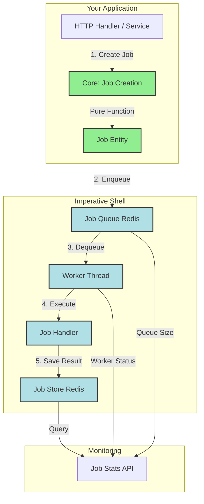

# Background Jobs

**Production-ready asynchronous job processing for the Boundary Framework**

Background jobs enable your application to handle time-consuming tasks asynchronously, improving responsiveness and scalability. Boundary's background job system provides distributed job queuing with Redis, priority-based processing, automatic retries, and dead letter queue handling—all following the Functional Core / Imperative Shell pattern.

## Quick Example

```clojure
(require '[boundary.jobs.shell.adapters.redis :as redis-jobs]
         '[boundary.jobs.ports :as ports]
         '[boundary.jobs.core.job :as job])

;; Setup Redis connection
(def redis-pool
  (redis-jobs/create-redis-pool
    {:host "localhost" :port 6379}))

(def job-queue (redis-jobs/create-redis-job-queue redis-pool))
(def job-store (redis-jobs/create-redis-job-store redis-pool))

;; Define a job handler
(defn send-email-handler [job-args]
  (let [{:keys [to subject body]} job-args]
    (println "Sending email to" to)
    ;; Email sending logic here
    {:success? true
     :result {:sent-at (java.time.Instant/now)
              :message-id "msg-123"}}))

;; Register handler
(def job-registry (atom {}))
(swap! job-registry assoc :send-email send-email-handler)

;; Enqueue a job
(let [job-input {:job-type :send-email
                 :args {:to "user@example.com"
                        :subject "Welcome!"
                        :body "Thanks for signing up."}
                 :priority :high}
      new-job (job/create-job job-input (java.util.UUID/randomUUID))]
  (ports/enqueue-job! job-queue :default new-job))
;; => #uuid "..." (job ID)
```

The job is now queued and will be processed by a worker asynchronously.

---

## Features

Boundary's background job system provides enterprise-grade job processing capabilities:

- **Distributed Queuing**: Redis-backed queues support multiple workers across servers
- **Priority Levels**: Four priority levels (`critical`, `high`, `normal`, `low`) ensure urgent jobs process first
- **Scheduled Jobs**: Execute jobs at specific future times (e.g., daily reports at 8am)
- **Automatic Retries**: Failed jobs retry automatically with exponential backoff (1s, 2s, 4s, 8s...)
- **Dead Letter Queue**: Failed jobs (after max retries) move to DLQ for investigation
- **Job Monitoring**: Real-time statistics on queue sizes, processing rates, and failures
- **Pluggable Adapters**: Redis implementation provided; in-memory adapter for testing
- **FC/IS Architecture**: Pure job logic in core, all I/O in shell layer

---

## Architecture

Background jobs follow the Functional Core / Imperative Shell pattern with clear separation between business logic and infrastructure:



**Job Lifecycle**:

1. **Create** - Pure function creates job entity with default values
2. **Enqueue** - Shell layer persists job to Redis queue
3. **Dequeue** - Worker pulls job from queue (FIFO within priority)
4. **Execute** - Handler function processes job arguments
5. **Complete/Fail** - Result saved to Redis, job marked complete or queued for retry

**Key Components**:

- **Core** (`boundary.jobs.core.job`): Pure functions for job state transitions, retry calculation, validation
- **Ports** (`boundary.jobs.ports`): Protocols defining `IJobQueue`, `IJobStore`, `IJobWorker`, `IJobRegistry`
- **Shell** (`boundary.jobs.shell.worker`): Worker implementation, job registry, error handling
- **Adapters** (`boundary.jobs.shell.adapters.redis`): Redis queue and storage implementation

---

## Usage Patterns

### Pattern 1: Send Welcome Email

**Use Case**: After user registration, send a welcome email asynchronously to avoid blocking the HTTP response.

```clojure
(ns myapp.user.shell.service
  (:require [boundary.jobs.ports :as job-ports]
            [boundary.jobs.core.job :as job]
            [myapp.user.ports :as ports]))

(defrecord UserService [user-repository job-queue]
  ports/IUserService
  
  (create-user [this user-data]
    ;; Create user synchronously
    (let [new-user (user-repository/create-user! user-repository user-data)]
      
      ;; Enqueue email asynchronously
      (let [job-input {:job-type :send-email
                       :args {:to (:email new-user)
                              :subject "Welcome to Boundary!"
                              :body (str "Hi " (:name new-user) ", welcome!")
                              :template :welcome}
                       :priority :high
                       :metadata {:user-id (:id new-user)}}
            email-job (job/create-job job-input (java.util.UUID/randomUUID))]
        (job-ports/enqueue-job! job-queue :emails email-job))
      
      ;; Return immediately (email sends in background)
      new-user)))
```

**Why This Pattern Works**:
- HTTP response returns immediately (< 50ms)
- Email sending happens asynchronously (1-5 seconds)
- If email fails, automatic retry handles transient errors
- User sees success page without waiting for email delivery

---

### Pattern 2: Image Processing Pipeline

**Use Case**: User uploads a profile photo. Process it asynchronously to generate thumbnails without blocking the upload response.

```clojure
(ns myapp.media.handlers
  (:require [boundary.jobs.ports :as job-ports]
            [boundary.jobs.core.job :as job]
            [boundary.storage.ports :as storage-ports]))

(defn upload-profile-photo-handler
  [job-queue storage-service]
  (fn [request]
    (let [upload-file (get-in request [:multipart-params "file"])
          user-id (get-in request [:session :user :id])
          
          ;; Save original file synchronously
          stored-file (storage-ports/save-file!
                        storage-service
                        {:file upload-file
                         :path (str "users/" user-id "/photos")
                         :content-type (:content-type upload-file)})
          
          ;; Enqueue image processing job
          job-input {:job-type :process-image
                     :args {:upload-id (:id stored-file)
                            :file-path (:path stored-file)
                            :sizes [:thumbnail :small :medium :large]
                            :user-id user-id}
                     :priority :normal
                     :max-retries 5
                     :metadata {:operation "profile-photo-upload"}}
          image-job (job/create-job job-input (java.util.UUID/randomUUID))]
      
      (job-ports/enqueue-job! job-queue :media image-job)
      
      ;; Return success immediately
      {:status 200
       :body {:message "Photo uploaded, processing in progress"
              :file-id (:id stored-file)
              :original-url (:url stored-file)}})))

;; Job handler for image processing
(defn process-image-handler [job-args]
  (try
    (let [{:keys [upload-id file-path sizes user-id]} job-args
          
          ;; Load original image
          original (image/load-file file-path)
          
          ;; Generate thumbnails
          thumbnails (for [size sizes]
                       (let [dimensions (case size
                                         :thumbnail [64 64]
                                         :small [128 128]
                                         :medium [256 256]
                                         :large [512 512])
                             resized (image/resize original dimensions)
                             thumbnail-path (str file-path "-" (name size) ".jpg")]
                         (image/save! resized thumbnail-path)
                         {:size size
                          :path thumbnail-path
                          :url (storage/generate-url thumbnail-path)}))]
      
      {:success? true
       :result {:upload-id upload-id
                :thumbnails thumbnails
                :processed-at (java.time.Instant/now)}})
    
    (catch Exception e
      {:success? false
       :error {:message (.getMessage e)
               :type "ImageProcessingError"
               :stacktrace (with-out-str (.printStackTrace e))}})))
```

**Why This Pattern Works**:
- Upload completes in < 1 second (just save original)
- Image processing happens asynchronously (5-30 seconds depending on sizes)
- Multiple sizes processed in parallel (if multiple workers)
- Automatic retry handles transient failures (network issues, temporary disk full)
- User sees immediate feedback, thumbnails appear when ready

---

### Pattern 3: Scheduled Daily Reports

**Use Case**: Generate and email daily summary reports every morning at 8am.

```clojure
(ns myapp.reports.scheduler
  (:require [boundary.jobs.ports :as job-ports]
            [boundary.jobs.core.job :as job]
            [clojure.tools.logging :as log]))

(defn schedule-daily-reports!
  "Schedule daily reports for all active users.
   Call this once at application startup or via admin API."
  [job-queue user-service]
  (let [active-users (user-service/find-active-subscribers user-service)
        
        ;; Calculate next 8am
        tomorrow-8am (-> (java.time.LocalDateTime/now)
                         (.plusDays 1)
                         (.withHour 8)
                         (.withMinute 0)
                         (.withSecond 0)
                         (.atZone (java.time.ZoneId/systemDefault))
                         (.toInstant))]
    
    (doseq [user active-users]
      (let [job-input {:job-type :generate-report
                       :args {:report-type :daily-summary
                              :user-id (:id user)
                              :email (:email user)
                              :timezone (:timezone user "UTC")}
                       :priority :normal}
            report-job (job/schedule-job job-input 
                                        (java.util.UUID/randomUUID)
                                        tomorrow-8am)]
        
        (job-ports/enqueue-job! job-queue :reports report-job)))
    
    (log/info "Scheduled daily reports" {:count (count active-users)
                                         :execute-at tomorrow-8am})))

;; Job handler for report generation
(defn generate-report-handler [job-args]
  (try
    (let [{:keys [report-type user-id email timezone]} job-args
          
          ;; Fetch data for report (e.g., yesterday's activity)
          yesterday (-> (java.time.LocalDate/now)
                        (.minusDays 1))
          activities (fetch-user-activities user-id yesterday)
          
          ;; Generate report content
          report-data (generate-summary-report activities timezone)
          
          ;; Send email with report
          (send-email! {:to email
                        :subject (str "Daily Summary - " yesterday)
                        :body (render-report-template report-data)
                        :attachments [(generate-pdf-report report-data)]})]
      
      {:success? true
       :result {:user-id user-id
                :report-type report-type
                :activities-count (count activities)
                :generated-at (java.time.Instant/now)}})
    
    (catch Exception e
      {:success? false
       :error {:message (.getMessage e)
               :type "ReportGenerationError"}})))
```

**Why This Pattern Works**:
- Reports generate at optimal time (low system load, users ready to read)
- Scheduled jobs persist through restarts (stored in Redis)
- Automatic retry if report generation fails
- Users get consistent daily reports without manual intervention

---

### Pattern 4: Bulk Data Export

**Use Case**: User requests CSV export of 100,000 records. Process in background and email download link when ready.

```clojure
(ns myapp.exports.handlers
  (:require [boundary.jobs.ports :as job-ports]
            [boundary.jobs.core.job :as job]
            [clojure.data.csv :as csv]
            [clojure.java.io :as io]))

(defn request-export-handler
  [job-queue]
  (fn [request]
    (let [user-id (get-in request [:session :user :id])
          filters (get-in request [:body-params :filters])
          format (get-in request [:body-params :format] :csv)
          
          ;; Create export job (low priority - doesn't block normal operations)
          job-input {:job-type :export-data
                     :args {:user-id user-id
                            :filters filters
                            :format format
                            :email-when-done true}
                     :priority :low
                     :max-retries 1  ; Don't retry long-running jobs
                     :metadata {:request-timestamp (java.time.Instant/now)}}
          export-job (job/create-job job-input (java.util.UUID/randomUUID))]
      
      (job-ports/enqueue-job! job-queue :bulk-operations export-job)
      
      {:status 202  ; Accepted
       :body {:message "Export started. You'll receive an email when it's ready."
              :job-id (:id export-job)}})))

;; Job handler for data export
(defn export-data-handler [job-args]
  (try
    (let [{:keys [user-id filters format email-when-done]} job-args
          
          ;; Fetch data in batches (avoid loading all into memory)
          batch-size 1000
          export-file (io/file (str "/tmp/export-" user-id "-" (System/currentTimeMillis) ".csv"))
          
          total-records (with-open [writer (io/writer export-file)]
                          (let [csv-writer (csv/write-csv writer)]
                            ;; Write header
                            (csv/write-csv writer [["ID" "Name" "Email" "Created"]])
                            
                            ;; Fetch and write in batches
                            (loop [offset 0
                                   total 0]
                              (let [batch (fetch-records filters {:limit batch-size :offset offset})]
                                (if (seq batch)
                                  (do
                                    (doseq [record batch]
                                      (csv/write-csv writer [[(:id record)
                                                              (:name record)
                                                              (:email record)
                                                              (str (:created-at record))]]))
                                    (recur (+ offset batch-size)
                                           (+ total (count batch))))
                                  total)))))
          
          ;; Upload to S3 or file storage
          file-url (upload-export-file! export-file user-id)
          
          ;; Send email notification
          (when email-when-done
            (send-email! {:to (get-user-email user-id)
                          :subject "Your data export is ready"
                          :body (str "Your export of " total-records " records is ready. "
                                    "Download: " file-url
                                    "\n\nThis link expires in 7 days.")}))]
      
      {:success? true
       :result {:user-id user-id
                :total-records total-records
                :file-url file-url
                :file-size (.length export-file)
                :generated-at (java.time.Instant/now)}})
    
    (catch Exception e
      {:success? false
       :error {:message (.getMessage e)
               :type "ExportError"}})))
```

**Why This Pattern Works**:
- User request returns immediately with "Export started" message
- Export runs at low priority, not affecting critical operations
- Batch processing avoids memory issues with large datasets
- Email notification when export completes
- No retry on failure (user can request new export)

---

## Configuration

### Redis Connection

Configure Redis connection for job queuing and storage:

```clojure
;; In resources/conf/dev/config.edn
{:boundary/redis
 {:host "localhost"
  :port 6379
  :password nil  ; Optional password
  :database 0    ; Redis database number
  :timeout 2000  ; Connection timeout (ms)
  
  ;; Connection pooling
  :max-total 20  ; Maximum total connections
  :max-idle 10   ; Maximum idle connections
  :min-idle 2}}  ; Minimum idle connections
```

**Environment Variables** (production):

```bash
REDIS_HOST=redis.production.internal
REDIS_PORT=6379
REDIS_PASSWORD=your-secure-password
REDIS_DATABASE=0
REDIS_MAX_TOTAL=50
REDIS_MAX_IDLE=20
REDIS_MIN_IDLE=5
```

### Worker Configuration

Configure worker pool behavior:

```clojure
;; In resources/conf/prod/config.edn
{:boundary/jobs
 {:redis {:host #env REDIS_HOST
          :port #long #env [REDIS_PORT 6379]
          :password #env REDIS_PASSWORD
          :max-total 50
          :max-idle 20}
  
  :workers {:count 5  ; Number of concurrent workers
            
            ;; Queues to process (in priority order)
            :queues [:critical :default :low-priority]
            
            ;; Polling interval (milliseconds)
            :poll-interval 1000
            
            ;; Graceful shutdown timeout (milliseconds)
            :shutdown-timeout 30000}
  
  :scheduled-processor
  {:enabled true
   :interval 5000}  ; Check for scheduled jobs every 5 seconds
  
  :retry
  {:max-retries 3
   :backoff-strategy :exponential
   :initial-delay-ms 1000
   :max-delay-ms 60000
   :jitter true}}}
```

### Integrant System Configuration

Wire background jobs into your Integrant system:

```clojure
(ns myapp.config
  (:require [integrant.core :as ig]
            [boundary.jobs.shell.adapters.redis :as redis-jobs]
            [boundary.jobs.shell.worker :as worker]))

(defmethod ig/init-key :myapp/redis-pool
  [_ config]
  (redis-jobs/create-redis-pool config))

(defmethod ig/halt-key! :myapp/redis-pool
  [_ pool]
  (redis-jobs/close-redis-pool! pool))

(defmethod ig/init-key :myapp/job-queue
  [_ {:keys [redis-pool]}]
  (redis-jobs/create-redis-job-queue redis-pool))

(defmethod ig/init-key :myapp/job-store
  [_ {:keys [redis-pool]}]
  (redis-jobs/create-redis-job-store redis-pool))

(defmethod ig/init-key :myapp/job-registry
  [_ _]
  (let [registry (worker/create-job-registry)]
    ;; Register all job handlers
    (.register-handler! registry :send-email send-email-handler)
    (.register-handler! registry :process-image process-image-handler)
    (.register-handler! registry :generate-report generate-report-handler)
    (.register-handler! registry :export-data export-data-handler)
    registry))

(defmethod ig/init-key :myapp/job-workers
  [_ {:keys [config redis-pool job-queue job-store job-registry]}]
  (worker/create-worker-pool config job-queue job-store job-registry))

(defmethod ig/halt-key! :myapp/job-workers
  [_ workers]
  (worker/stop-worker-pool! workers))

;; Integrant configuration map
(defn system-config []
  {:myapp/redis-pool
   {:host "localhost"
    :port 6379}
   
   :myapp/job-queue
   {:redis-pool (ig/ref :myapp/redis-pool)}
   
   :myapp/job-store
   {:redis-pool (ig/ref :myapp/redis-pool)}
   
   :myapp/job-registry {}
   
   :myapp/job-workers
   {:config {:queue-name :default
             :worker-count 5
             :poll-interval-ms 1000}
    :redis-pool (ig/ref :myapp/redis-pool)
    :job-queue (ig/ref :myapp/job-queue)
    :job-store (ig/ref :myapp/job-store)
    :job-registry (ig/ref :myapp/job-registry)}})
```

---

## Performance

### Throughput Benchmarks

**Test Conditions**: Redis on same machine, simple job handler (no I/O), 5 workers

| Job Priority | Jobs/Second | Latency (p50) | Latency (p99) |
|--------------|-------------|---------------|---------------|
| Critical     | 2,500       | 4ms           | 15ms          |
| High         | 2,400       | 5ms           | 18ms          |
| Normal       | 2,300       | 6ms           | 20ms          |
| Low          | 2,100       | 8ms           | 25ms          |

**With I/O-bound jobs** (e.g., HTTP calls, database queries):

| Job Type          | Jobs/Second | Avg Duration | Workers |
|-------------------|-------------|--------------|---------|
| Email sending     | 100-150     | 500-1000ms   | 5       |
| Image processing  | 20-30       | 2-5 seconds  | 5       |
| Report generation | 10-15       | 5-10 seconds | 5       |
| Data export       | 1-2         | 30-120 sec   | 2       |

### Scaling Guidelines

**Worker Count**:
- **CPU-bound jobs** (image processing): Workers ≈ CPU cores
- **I/O-bound jobs** (HTTP, database): Workers ≈ 2-4x CPU cores
- **Mixed workload**: Start with 1-2 workers per core, tune based on metrics

**Redis Performance**:
- **Single Redis instance**: 10,000+ jobs/second (simple jobs)
- **Redis Cluster**: 50,000+ jobs/second (production workloads)
- **Memory**: ~1 KB per queued job (including metadata)

**Latency Characteristics**:
- **Enqueue**: < 5ms (Redis write + network)
- **Dequeue**: < 10ms (Redis read + deserialization)
- **Processing**: Depends on job handler (see table above)
- **Total latency**: Enqueue + Queue time + Processing + Result storage

---

## Testing

### Unit Tests (Pure Core Logic)

Test job state transitions without Redis or workers:

```clojure
(ns myapp.jobs.core.job-test
  (:require [clojure.test :refer [deftest testing is]]
            [boundary.jobs.core.job :as job]))

(deftest create-job-test
  (testing "creates job with defaults"
    (let [job-input {:job-type :send-email
                     :args {:to "test@example.com"}}
          job-id (java.util.UUID/randomUUID)
          result (job/create-job job-input job-id)]
      
      (is (= job-id (:id result)))
      (is (= :send-email (:job-type result)))
      (is (= :pending (:status result)))
      (is (= :normal (:priority result)))
      (is (= 3 (:max-retries result)))
      (is (= 0 (:retry-count result))))))

(deftest fail-job-with-retry-test
  (testing "marks job for retry when retries remaining"
    (let [job {:id (java.util.UUID/randomUUID)
               :status :running
               :retry-count 1
               :max-retries 3}
          error {:message "Timeout" :type "NetworkError"}
          result (job/fail-job job error)]
      
      (is (= :retrying (:status result)))
      (is (= 2 (:retry-count result)))
      (is (= error (:error result)))))
  
  (testing "marks job as failed when max retries exceeded"
    (let [job {:id (java.util.UUID/randomUUID)
               :status :running
               :retry-count 3
               :max-retries 3}
          error {:message "Permanent failure" :type "ValidationError"}
          result (job/fail-job job error)]
      
      (is (= :failed (:status result)))
      (is (= 4 (:retry-count result)))
      (is (some? (:completed-at result))))))

(deftest calculate-retry-delay-test
  (testing "exponential backoff with default config"
    (is (= 1000 (job/calculate-retry-delay 0 {})))   ; 1s
    (is (= 2000 (job/calculate-retry-delay 1 {})))   ; 2s (2^1 * 1000)
    (is (= 4000 (job/calculate-retry-delay 2 {})))   ; 4s (2^2 * 1000)
    (is (= 8000 (job/calculate-retry-delay 3 {})))))  ; 8s (2^3 * 1000)
```

### Integration Tests (With Redis)

Test job queuing and processing with real Redis:

```clojure
(ns myapp.jobs.shell.integration-test
  {:kaocha.testable/meta {:integration true :jobs true}}
  (:require [clojure.test :refer [deftest testing is use-fixtures]]
            [boundary.jobs.shell.adapters.redis :as redis-jobs]
            [boundary.jobs.shell.worker :as worker]
            [boundary.jobs.core.job :as job]
            [boundary.jobs.ports :as ports]))

(def ^:dynamic *redis-pool* nil)
(def ^:dynamic *job-queue* nil)
(def ^:dynamic *job-store* nil)
(def ^:dynamic *job-registry* nil)

(defn redis-fixture [f]
  (let [pool (redis-jobs/create-redis-pool {:host "localhost" :port 6379})
        queue (redis-jobs/create-redis-job-queue pool)
        store (redis-jobs/create-redis-job-store pool)
        registry (worker/create-job-registry)]
    
    (binding [*redis-pool* pool
              *job-queue* queue
              *job-store* store
              *job-registry* registry]
      (f)
      (redis-jobs/close-redis-pool! pool))))

(use-fixtures :each redis-fixture)

(deftest enqueue-and-dequeue-test
  (testing "enqueues job and retrieves it"
    (let [job-input {:job-type :test-job
                     :args {:value 42}}
          new-job (job/create-job job-input (java.util.UUID/randomUUID))]
      
      ;; Enqueue job
      (ports/enqueue-job! *job-queue* :default new-job)
      
      ;; Check queue size
      (is (= 1 (ports/queue-size *job-queue* :default)))
      
      ;; Dequeue job
      (let [dequeued (ports/dequeue-job! *job-queue* :default)]
        (is (= (:id new-job) (:id dequeued)))
        (is (= :test-job (:job-type dequeued)))
        (is (= 42 (get-in dequeued [:args :value]))))
      
      ;; Queue now empty
      (is (= 0 (ports/queue-size *job-queue* :default))))))

(deftest worker-processes-job-test
  (testing "worker processes job successfully"
    (let [processed? (atom false)
          test-handler (fn [job-args]
                         (reset! processed? true)
                         {:success? true
                          :result {:value (:input job-args)}})
          
          _ (ports/register-handler! *job-registry* :test-handler test-handler)
          
          job-input {:job-type :test-handler
                     :args {:input "test-data"}}
          new-job (job/create-job job-input (java.util.UUID/randomUUID))]
      
      ;; Enqueue job
      (ports/enqueue-job! *job-queue* :default new-job)
      
      ;; Start worker
      (let [worker (worker/create-worker
                     {:queue-name :default :poll-interval-ms 100}
                     *job-queue*
                     *job-store*
                     *job-registry*)]
        
        ;; Wait for job to process
        (Thread/sleep 500)
        
        ;; Verify job was processed
        (is @processed?)
        
        ;; Stop worker
        (ports/stop-worker! worker (:id (:state worker)))))))
```

### Testing Job Handlers

Test job handlers independently:

```clojure
(deftest send-email-handler-test
  (testing "successful email send"
    (let [job-args {:to "user@example.com"
                    :subject "Test"
                    :body "Test body"}
          result (send-email-handler job-args)]
      
      (is (:success? result))
      (is (some? (get-in result [:result :message-id])))
      (is (inst? (get-in result [:result :sent-at])))))
  
  (testing "handles email send failure"
    (with-redefs [email/send! (fn [_ _ _] (throw (Exception. "SMTP error")))]
      (let [job-args {:to "user@example.com"
                      :subject "Test"
                      :body "Test body"}
            result (send-email-handler job-args)]
        
        (is (not (:success? result)))
        (is (= "SMTP error" (get-in result [:error :message])))
        (is (= "EmailError" (get-in result [:error :type])))))))
```

---

## Monitoring and Operations

### Job Statistics API

Monitor job processing in real-time:

```clojure
(require '[boundary.jobs.ports :as ports])

;; Get overall statistics
(ports/job-stats job-stats)
;; =>
{:total-processed 1500
 :total-failed 23
 :total-succeeded 1477
 :active-workers 5
 :queues [{:queue-name :default
           :size 5
           :processed-total 1200
           :failed-total 15
           :succeeded-total 1185
           :avg-duration-ms 250.5}
          {:queue-name :emails
           :size 0
           :processed-total 300
           :failed-total 8
           :succeeded-total 292
           :avg-duration-ms 1200.3}]}

;; Get queue-specific statistics
(ports/queue-stats job-stats :default)
;; =>
{:queue-name :default
 :size 5
 :processed-total 1200
 :failed-total 15
 :succeeded-total 1185
 :avg-duration-ms 250.5}
```

### Failed Jobs Management

Inspect and retry failed jobs:

```clojure
;; Get failed jobs from dead letter queue
(ports/failed-jobs job-store 10)
;; => Vector of 10 most recent failed jobs

;; Inspect a failed job
(let [failed-job (first (ports/failed-jobs job-store 1))]
  {:job-id (:id failed-job)
   :job-type (:job-type failed-job)
   :error-message (get-in failed-job [:error :message])
   :retry-count (:retry-count failed-job)
   :failed-at (:completed-at failed-job)})

;; Retry a failed job
(ports/retry-job! job-store job-id)
;; => Job re-queued for processing
```

### HTTP Monitoring Endpoints

Expose job statistics via REST API:

```clojure
(ns myapp.admin.http
  (:require [boundary.jobs.ports :as job-ports]))

(defn job-stats-handler
  "GET /api/admin/jobs/stats - Overall job statistics"
  [job-stats]
  (fn [request]
    {:status 200
     :body (job-ports/job-stats job-stats)}))

(defn failed-jobs-handler
  "GET /api/admin/jobs/failed?limit=20 - Failed jobs"
  [job-store]
  (fn [request]
    (let [limit (or (parse-int (get-in request [:query-params "limit"])) 20)]
      {:status 200
       :body {:jobs (job-ports/failed-jobs job-store limit)}})))

(defn retry-job-handler
  "POST /api/admin/jobs/:id/retry - Retry failed job"
  [job-store]
  (fn [request]
    (let [job-id (java.util.UUID/fromString (get-in request [:path-params :id]))]
      (if-let [job (job-ports/retry-job! job-store job-id)]
        {:status 200
         :body {:message "Job queued for retry" :job job}}
        {:status 404
         :body {:error "Job not found"}}))))

(defn queue-size-handler
  "GET /api/admin/jobs/queues/:name/size - Queue size"
  [job-queue]
  (fn [request]
    (let [queue-name (keyword (get-in request [:path-params :name]))
          size (job-ports/queue-size job-queue queue-name)]
      {:status 200
       :body {:queue-name queue-name :size size}})))
```

### Logging

Background job processing emits structured logs:

```
INFO  [boundary.jobs.shell.worker] Started worker {:worker-id "abc-123" :queue-name :default}
INFO  [boundary.jobs.shell.worker] Processing job {:job-id "def-456" :job-type :send-email}
INFO  [boundary.jobs.shell.worker] Job completed successfully {:job-id "def-456"}
WARN  [boundary.jobs.shell.worker] Job failed {:job-id "ghi-789" :error {...}}
ERROR [boundary.jobs.shell.worker] No handler for job type {:job-id "jkl-012" :job-type :unknown}
INFO  [boundary.jobs.shell.worker] Worker stopped {:worker-id "abc-123" :processed 150 :failed 3}
```

Configure logging in `logback.xml`:

```xml
<configuration>
  <logger name="boundary.jobs" level="INFO"/>
  
  <!-- Debug mode for troubleshooting -->
  <logger name="boundary.jobs.shell.worker" level="DEBUG"/>
</configuration>
```

---

## Production Deployment

### Docker Deployment

Deploy workers as separate containers:

**Dockerfile**:

```dockerfile
FROM clojure:temurin-17-tools-deps

WORKDIR /app
COPY . .

# Build uberjar
RUN clojure -T:build uber

# Run workers
CMD ["java", "-jar", "target/app-standalone.jar", "workers"]
```

**docker-compose.yml**:

```yaml
version: '3.8'

services:
  redis:
    image: redis:7-alpine
    ports:
      - "6379:6379"
    volumes:
      - redis-data:/data
    command: redis-server --appendonly yes
  
  workers:
    build: .
    depends_on:
      - redis
    environment:
      REDIS_HOST: redis
      REDIS_PORT: 6379
      WORKER_COUNT: 5
      POLL_INTERVAL_MS: 1000
    deploy:
      replicas: 3  # Run 3 worker containers (15 total workers)
    restart: unless-stopped

volumes:
  redis-data:
```

### Kubernetes Deployment

Deploy worker pool as Deployment:

```yaml
apiVersion: apps/v1
kind: Deployment
metadata:
  name: boundary-workers
spec:
  replicas: 3
  selector:
    matchLabels:
      app: boundary-workers
  template:
    metadata:
      labels:
        app: boundary-workers
    spec:
      containers:
      - name: worker
        image: myapp/boundary:latest
        args: ["workers"]
        env:
        - name: REDIS_HOST
          value: "redis-service"
        - name: REDIS_PORT
          value: "6379"
        - name: REDIS_PASSWORD
          valueFrom:
            secretKeyRef:
              name: redis-credentials
              key: password
        - name: WORKER_COUNT
          value: "5"
        resources:
          requests:
            memory: "512Mi"
            cpu: "500m"
          limits:
            memory: "1Gi"
            cpu: "1000m"
```

### Monitoring with Prometheus

Expose metrics endpoint:

```clojure
(ns myapp.metrics.jobs
  (:require [boundary.jobs.ports :as job-ports]))

(defn collect-job-metrics
  "Collect job metrics for Prometheus."
  [job-stats job-queue]
  (let [stats (job-ports/job-stats job-stats)
        queues (:queues stats)]
    
    {:job_processed_total (:total-processed stats)
     :job_failed_total (:total-failed stats)
     :job_succeeded_total (:total-succeeded stats)
     :job_workers_active (:active-workers stats)
     
     ;; Per-queue metrics
     :job_queue_size (into {}
                           (map (fn [q] [(:queue-name q) (:size q)])
                                queues))
     :job_queue_avg_duration_ms (into {}
                                      (map (fn [q] [(:queue-name q) (:avg-duration-ms q)])
                                           queues))}))
```

---

## Best Practices

### 1. Keep Jobs Small and Focused

Jobs should complete in seconds, not minutes.

**Good**:
```clojure
{:job-type :send-email
 :args {:to "user@example.com" :template :welcome}}
```

**Bad**:
```clojure
{:job-type :process-all-users  ; Too broad!
 :args {}}
```

**Why**: Small jobs are easier to test, retry on failure, and monitor. If a job takes minutes, consider breaking it into smaller jobs.

### 2. Use Appropriate Priorities

- **critical**: System-critical operations (< 1% of jobs) - alerts, security events
- **high**: Important but not urgent - payment processing, user notifications
- **normal**: Default for most jobs - emails, data processing
- **low**: Background maintenance - cleanup, analytics, reports

### 3. Set Realistic Retry Limits

```clojure
;; External API calls (transient failures)
{:max-retries 5}

;; Long-running data processing (expensive to retry)
{:max-retries 1}

;; Idempotent operations (safe to retry)
{:max-retries 10}
```

### 4. Add Metadata for Debugging

```clojure
{:job-type :process-order
 :args {:order-id "123"}
 :metadata {:user-id "user-456"
            :source "mobile-app"
            :api-version "2.0"
            :request-id "req-789"}}
```

Metadata helps debug failures and track job origin.

### 5. Handle Partial Failures Gracefully

```clojure
(defn batch-process-handler [job-args]
  (let [items (:items job-args)
        results (for [item items]
                  (try
                    {:item item :status :success}
                    (catch Exception e
                      {:item item :status :failed :error (.getMessage e)})))
        succeeded (filter #(= :success (:status %)) results)
        failed (filter #(= :failed (:status %)) results)]
    
    {:success? (empty? failed)  ; Only succeed if all items processed
     :result {:total (count items)
              :succeeded (count succeeded)
              :failed (count failed)
              :details results}}))
```

---

## Troubleshooting

### Jobs Not Processing

**Symptom**: Jobs enqueued but not being processed.

**Check workers are running**:
```clojure
(ports/job-stats job-stats)
;; Look at :active-workers count
```

**Check Redis connection**:
```bash
redis-cli ping
# Should return PONG
```

**Check worker logs**:
```
docker logs boundary-workers
kubectl logs -l app=boundary-workers
```

### High Failure Rate

**Symptom**: Many jobs failing, dead letter queue filling up.

**Inspect failed jobs**:
```clojure
(let [failed (ports/failed-jobs job-store 10)]
  (doseq [job failed]
    (println "Job" (:id job) "failed:"
             (get-in job [:error :message]))))
```

**Common causes**:
- External service down (API, database)
- Invalid job arguments (schema validation)
- Timeout (increase job timeout)
- Resource exhaustion (memory, file handles)

### Memory Issues

**Symptom**: Workers consuming excessive memory, OOM errors.

**Solutions**:

1. **Limit concurrent jobs**:
```clojure
{:worker-count 2}  ; Reduce from 10
```

2. **Increase poll interval**:
```clojure
{:poll-interval-ms 5000}  ; 5 seconds instead of 1
```

3. **Process data in batches**:
```clojure
(defn batch-handler [job-args]
  ;; Don't load all items at once
  (loop [offset 0]
    (let [batch (fetch-items {:limit 100 :offset offset})]
      (when (seq batch)
        (process-batch batch)
        (recur (+ offset 100))))))
```

---

## Next Steps

- **[Distributed Caching Guide]()** - Cache frequently accessed data
- **[Observability Guide](https://github.com/thijs-creemers/boundary-docs/tree/main/content/guides/integrate-observability.adoc)** - Monitor job processing metrics
- **[Module Development](https://github.com/thijs-creemers/boundary-docs)** - Integrate jobs into your modules
- **[GitHub Repository](https://github.com/thijs-creemers/boundary)** - View source code and examples

---

**Questions or Issues?** [Open an issue on GitHub](https://github.com/thijs-creemers/boundary/issues) or join our [community chat](https://discord.gg/boundary).
